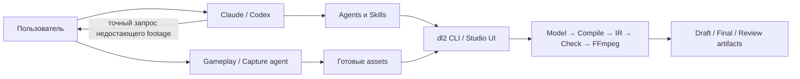

# Studio v2 — производственный план (детализация Phase 5)

Статус: **утверждён 2026-07-16** после независимого ревью против кода
(verdict: approve with changes — все правки внесены в этот текст).
Имплементировать по этапам, не расширяя scope.

Связь с контрактом: `docs/ARCHITECTURE_V2.md` описывает build-фазы 0–4
(DONE 2026-07-16) и Phase 5 «switchover». **Этапы 0–3 этого плана — путь к
Phase 5.** Нумерация этапов локальна для этого документа и не связана с
нумерацией фаз контракта.

Ссылки file:line в этом документе — доказательства из ревью, актуальные на
2026-07-16; при имплементации сверять по смыслу, не по номеру строки.

---

## 1. Концепт продукта

Studio v2 — личный локальный движок для быстрого производства девлогов,
reels, промороликов и трейлеров.

Продукт создаётся для одного пользователя и не планируется как публичный
сервис.

Главная цель:

> Запустить Claude или Codex, описать нужный ролик, указать проект и
> доступные материалы, после чего получить draft за вечер и final максимум
> за день с минимальным участием пользователя.

Studio не содержит собственного AI-runtime. Управление производством
выполняет внешний Claude/Codex через agents, skills, CLI и файлы проекта.

Легаси-движок v1 (`common/devlog`, CLI `dl`) для этого плана **не
существует**: никаких fallback-ов на v1-команды, никаких упоминаний v1 в
v2-workflow. Сам код v1 заморожен и не трогается (обслуживает старые
проекты).

## 2. Распределение ответственности



### Пользователь

- формулирует тему и цель ролика;
- предоставляет проект и существующие материалы;
- при необходимости запускает отдельного gameplay/capture agent;
- записывает финальный VO, если scratch VO недостаточно;
- принимает финальный результат.

### Claude/Codex

- изучает проект;
- пишет сценарий;
- планирует beats и визуалы;
- выбирает существующие assets;
- управляет `dl2`;
- вызывает reviewer agents;
- применяет безопасные изменения;
- формулирует точный запрос на недостающий материал;
- доводит ролик до final.

### Studio v2

- принимает готовые audio/video/image/music assets;
- валидирует их;
- компилирует edit;
- быстро создаёт draft;
- проверяет техническую корректность;
- собирает final;
- предоставляет понятные результаты агенту.

### Gameplay/capture agent

Это отдельная система вне Studio:

- запускает игру;
- выполняет нужные действия;
- записывает gameplay;
- сохраняет готовый файл по указанному пути.

Studio не должна уметь играть, управлять игрой или самостоятельно
записывать gameplay.

---

## 3. Основной пользовательский сценарий

Пользователь пишет:

> Сделай двухминутный девлог о новой боевой системе. Изучи проект,
> используй материалы из `data/footage`, сделай scratch VO, проверь draft
> и доведи ролик до final. Спрашивай меня только если не хватает
> настоящего footage или нужно изменить VO.

Claude/Codex:

1. Читает `AGENTS.md` и нужный skill.
2. Изучает проект, commits, документацию и доступные assets.
3. Создаёт короткий сценарий.
4. Создаёт или обновляет v2 edit.
5. Делает scratch VO и words.
6. Подключает готовые assets.
7. Если материала не хватает — пишет конкретный запрос.
8. Выполняет `dl2 check`.
9. Рендерит 540p draft.
10. Создаёт contact sheet/keyframes.
11. Запускает video-reviewer.
12. Применяет безопасные исправления.
13. Повторяет review не более 3 раз по умолчанию и не более 5 раз максимум.
14. Выполняет final render.
15. Возвращает пользователю итоговый MP4 и короткий отчёт.

Ожидаемое участие пользователя:

- начальная задача;
- предоставление отсутствующего gameplay или финального VO;
- финальное одобрение.

---

## 4. Входы и выходы

### Входы

- brief или сообщение пользователя;
- исходный проект;
- готовые gameplay/video assets;
- изображения и screenshots;
- VO или текст для scratch VO;
- музыка и SFX;
- стиль конкретного проекта.

### Выходы

Минимальный набор:

```text
draft.mp4
contact_sheet.jpg
review feedback
final.mp4
publish package
```

Для YouTube дополнительно:

```text
thumbnail
title variants
description
chapters
tags
```

---

## 5. Что входит в Studio v2

Проверено против кода 2026-07-16; пометки в скобках — текущий статус.

- Python DSL для Edit/Beat/Chunk/Scene *(есть)*.
- Word-index timing *(есть)*.
- Компиляция в Timeline IR *(есть)*.
- FFmpeg render *(есть)*.
- Audio mix, music, ducking, SFX и loudness normalization *(есть:
  music beds через границы битов, sidechain ducking от VO, SFX по
  word-якорям, двухпроходный −14 LUFS loudnorm)*.
- Draft/final encoding profiles *(есть, централизованы в `codec_args`)*.
- Per-beat cache *(есть; дефекты чинятся в этапе 0)*.
- Mechanical quality gates *(есть; включение перед render — этап 0)*.
- CLI `dl2` *(есть)*.
- Studio UI для VO takes, обработки и preview *(есть; гонки чинятся в
  этапе 0)*.
- Reviewer feedback *(есть: `GET/POST /api/feedback` →
  `data/review/feedback.json` + вкладка Feedback в webui)*.
- Contact sheet / keyframes для ревью *(НЕТ — новая работа, этап 1)*.
- HyperFrames-ассеты: тонкий мост к `npx hyperframes` *(НЕТ в v2 — порт,
  этап 1)*.
- Word-synced субтитры/captions для reel *(НЕТ — рендер-примитива не
  существует, karaoke-подсветка живёт только в браузерном рекордере;
  новая работа, этап 1)*.
- Agents и skills для управления внешним Claude/Codex *(частично —
  обновление в этапе 2)*.

## 6. Что сознательно не входит

Не реализовывать:

- встроенную LLM;
- собственный AI agent runtime;
- model-provider abstraction;
- manifest-first workflow;
- собственную систему AI memory;
- capture subsystem;
- управление игрой;
- OBS/CDP integration внутри Studio;
- asset intelligence, embeddings и semantic catalog;
- полноценный timeline editor;
- multi-user и authentication platform;
- cloud render;
- plugin marketplace;
- замену FFmpeg на Remotion или HyperFrames;
- нативный PIL-генератор инфографики (v1 `dl gen`) — HyperFrames покрывает
  его случаи; см. §8;
- универсальную production platform.

Если чего-то нет в этом scope, сначала проверить, требуется ли оно для
реального ролика.

---

# 7. План имплементации

## Этап 0 — исправить только опасные дефекты

### Цель

Перед использованием Studio внешним агентом исключить сценарии, когда
команда завершается успешно, но создаёт неправильный ролик или портит
состояние (кэш, файлы beat).

Никаких новых крупных возможностей в этом этапе.

Все 12 дефектов ниже **подтверждены трассировкой кода** (2026-07-16).

### Общая зависимость этапа

Пункты 0.2, 0.6 и 0.10 меняют cache keys и/или формат cache entry.
Требование: bump версии формата entry; старые записи считаются промахами.
После этапа 0 ожидаются холодные рендеры — это норма, не регрессия.

## 0.1. Исправить `--stale`

Проблема:

При cache hit в `--stale`-пути существующий `data/finalize/<beat>.mp4`
восстанавливается из cache key **только если файла нет на диске**
(`cli/__init__.py:477-478`). Существующий файл от другого resolution,
quality или edit молча остаётся и попадает в assemble. Дефект специфичен
для `iter/render/final --stale`; `compose` и не-stale путь рематериализуют
корректно.

Требование:

- при cache hit materialize должен всегда гарантировать соответствие
  конкретному key;
- наличие output-файла не является доказательством его актуальности;
- `--stale` должен либо восстановить точный cache artifact, либо рендерить
  заново.

Существующий тест `test_cmd_iter_stale_skips_restore_when_file_already_present`
закрепляет дефектное поведение — заменить, а не сохранять.

Тест:

```text
render 360p
render 540p
iter --stale 360p
assert output == 360p cache artifact
```

## 0.2. Кэшировать MP4 и VO stem согласованно

Проблема:

Кэш хранит только MP4 (`cache/__init__.py:123-124`); VO stem пишется
только при реальном рендере (`render/beat.py:488-491`) и всегда отражает
последний рендер по этому пути. `assemble` берёт соседний stem с проверкой
только существования (`render/assemble.py:424-427`). Итог в mix-пути:
видео версии A + звук версии B. Fast-concat путь когерентен (звук из
самого MP4).

Минимальное решение:

- cache entry хранит MP4 и VO stem вместе;
- cache hit восстанавливает оба файла;
- если stem отсутствует или не соответствует key, entry не считается
  полным;
- assemble не доверяет произвольному существующему stem.

Не нужно строить общий artifact store. Достаточно расширить текущий
per-beat cache (с bump версии формата).

Тест:

```text
render A
render B
return to A via cache
assert MP4 == A
assert VO stem == A
assert assembled audio == A
```

## 0.3. Исправить `--no-cache`

Проблема:

`render_beat` пишет в `workdir/<beat>.mp4` и возвращает этот путь
(`render/beat.py:443,496`); оба `--no-cache` пути CLI передают
`workdir = out.parent` и копируют результат сам в себя →
`shutil.SameFileError` (`cli/__init__.py:268` и `:432-433`).

Требование:

- не копировать файл, если source и destination совпадают;
- `compose --no-cache` и `iter/render/final --no-cache` завершаются
  успешно;
- cache не читается и не записывается.

Существующий тест мокал `render_beat` с другим именем файла и потому не
ловил дефект — регрессионный тест должен использовать реальное поведение
путей.

## 0.4. Сделать checks обязательными перед render

Сейчас gate-пайплайн `run_checks` вызывается только из `dl2 check` и
`GET /api/check`; ни один render-путь его не зовёт. Пост-рендерный
`verify_output` существует (`render/beat.py:495`) — отсутствует именно
пред-рендерный gate.

Требование:

```text
resolve render profile
→ compile effective timeline
→ run checks
→ render
→ verify output
```

Применить к:

- `compose`;
- `iter`;
- `render`;
- `final`;
- Studio API render.

Draft может продолжаться при warnings, но не при mechanical errors.

## 0.5. Исправить VQ-SYNC

Проблема: `verify_output` читает только container duration и факт наличия
video stream (`check/__init__.py:183-204`); длительности стримов не
сравниваются.

Проверять отдельно:

- наличие video stream;
- наличие audio stream;
- video stream duration;
- audio stream duration;
- container duration;
- ожидаемую Timeline duration.

Контрпример, который обязан падать:

```text
video = 1 second
audio = 3 seconds
container = 3 seconds
expected = 3 seconds
```

## 0.6. Унифицировать resolution profiles

Проблема: CLI/API якорятся на ширину (`_WIDTH_PRESETS`,
`cli/__init__.py:61-68`; `_resize_design` `:186-208` — «4k» это всегда
3840 в ширину, вертикальный 4K → 3840×6826), webui — на высоту 540
(`webui/src/app.tsx:26-32`). Расходятся на любом не-16:9.

CLI и Studio должны использовать одинаковые явные размеры.

Минимальный набор:

```text
landscape draft = 960×540
landscape final = 1920×1080
landscape 4k    = 3840×2160

vertical draft  = 304×540
vertical final  = 1080×1920
vertical 4k     = 2160×3840
```

Не вычислять вертикальный `4k` как ширину `3840`.

Все profiles используются одинаково в:

- CLI;
- Studio;
- cache key;
- checks;
- renderer.

## 0.7. Исправить обработку VO takes

Подтверждённые дефекты Studio UI/API: beat id не фиксируется в момент
старта записи (`RecordTab.tsx:128,137,151`); переключение вкладки внутри
приложения размонтирует RecordTab и молча теряет идущую запись
(`RecordTab.tsx:46-54` → `rec.close()` без захвата blob; сохранённые takes
не теряются); два Process-джоба одного beat идут без lock
(`api/app.py:154-190`, ThreadPool `api/jobs.py:39`); WAV/words пишутся
сразу в финальные пути (`services/audio.py:227-231`,
`services/transcribe.py:174,183`); render читает beat во время замены.

Минимально необходимое:

- запись запоминает beat id в момент начала;
- переключение beat во время записи блокируется или требует остановки;
- смена вкладки не теряет идущую запись;
- два Process take одного beat не выполняются одновременно;
- WAV и words сначала создаются во временных файлах;
- в финальные пути они переходят только после успешной обработки обоих
  (temp + `os.replace`, паттерн уже есть в `cache.put`);
- render не читает beat во время замены WAV/words.

Не строить общую job platform. Достаточно per-beat lock и atomic
promotion.

Это самый трудоёмкий пункт этапа (три слоя: webui lifecycle, api-lock'и,
atomic promotion в services). Основной scratch-VO путь рекордер не
использует, поэтому блок 0.7+0.9 выполняется последним и может ехать
частями: сначала api-lock'и + atomic promotion, MediaRecorder-lifecycle —
отдельно.

## 0.8. Минимальный CI

Не нужна большая матрица.

Добавить один обязательный v2 job:

- Python 3.12;
- все `common/dlstudio/tests`;
- FFmpeg;
- Web UI typecheck;
- один real-FFmpeg E2E.

Windows-specific smoke можно оставить отдельной локальной командой, если
GitHub Windows CI заметно усложняет работу.

Выполнять последним. Если настройка GitHub-job затягивается — временно
заменить локальной командой (полная suite + real-FFmpeg smoke) и не
блокировать этап.

## 0.9. Отравление кэша через Studio API

Проблема:

`cache.put` пишет tmp-файл `{key}.tmp-{PID}` (`cache/__init__.py:178`) —
изоляция по PID работает для параллельного `-j` (ProcessPool), но
Studio API выполняет джобы в ThreadPoolExecutor с **одним PID**
(`api/jobs.py:39`), дедупликации задач нет, и `put` вызывается **вне**
`render_lock` (`api/app.py:235`). Два render-джоба одного beat делят
tmp-путь и исходный `data/finalize/<beat>.mp4` → в кэш публикуется
рваный MP4, который дальше молча раздаётся как hit (read-side
postcondition отсутствует).

Требование:

- tmp-имя уникально per-поток (thread id или uuid);
- `put` под per-key сериализацией, либо per-beat дедуп render-джобов;
- один и тот же beat не рендерится двумя джобами одновременно.

Тест:

```text
два параллельных render-job одного beat через API
assert cache entry валиден (ffprobe)
assert содержимое соответствует одному рендеру целиком
```

## 0.10. Включить шрифты в cache key

Проблема:

Identity-хэш ключа покрывает audio/words/bg_image, но не файлы шрифтов
(`cache/__init__.py:96-101`; от design в ключ попадают только
path-строки). Замена `main.ttf` по тому же пути не инвалидирует ни один
beat. Усугубляется `@lru_cache` на загрузке шрифта
(`render/raster/_util.py:72`): долгоживущий `dl2 studio` рендерит старым
шрифтом даже с `--no-cache`.

Требование:

- файлы шрифтов входят в identity-хэш cache key наравне с bg_image;
- процессный font-кэш инвалидируется по (path, mtime, size) или
  сбрасывается при reload.

Тест:

```text
render
заменить ttf по тому же пути
render
assert key изменился и вывод отличается
```

## 0.11. Битый шрифт — ошибка, а не тихий fallback

Проблема:

Ошибка `ImageFont.truetype` глотается и подменяется PIL default
(`render/raster/_util.py:77-86`); probe для шрифтов оставляет
`readable=None` (`compile/probe.py:82-83`), поэтому VQ-ASSET не
срабатывает. Существующий, но битый/несовместимый TTF проходит `dl2
check`, рендер зелёный, все плашки — крошечным bitmap-шрифтом.

Требование:

- check валидирует загружаемость каждого шрифта;
- render при незагружаемом шрифте падает с внятной ошибкой, а не
  деградирует.

## 0.12. Кодировки subprocess на Windows

Проблема:

Все вызовы `subprocess.run` используют `text=True` без `encoding=`
(`render/beat.py:110,477`, `render/assemble.py:136,529`,
`compile/probe.py:104`, `check/__init__.py:164`). На русской Windows
UTF-8 stderr ffmpeg с кириллическим путём → `UnicodeDecodeError`;
`dl2 final` падает в `_loudnorm_measure`. Это громкий, а не тихий отказ,
но кириллические пути — целевое окружение.

Требование: `encoding="utf-8", errors="replace"` во всех
subprocess-вызовах движка.

Тест: полный FFmpeg-path во временной папке с кириллицей и пробелом в
пути.

### Порядок реализации этапа 0

1. 0.3 + 0.12 — тривиальные, разблокируют отладку.
2. 0.1 + 0.2 + 0.10 + 0.6 одним блоком — всё, что меняет cache keys и
   формат entry, с **одним** bump версии формата (не два).
3. 0.5 + 0.11 — усиление checks.
4. 0.4 — обязательные checks перед render (теперь без ложных
   срабатываний).
5. 0.7 + 0.9 одним блоком (Studio API: одни и те же lock'и/дедуп; см.
   заметку о трудоёмкости в 0.7).
6. 0.8 — CI.

### Приёмка этапа 0

- Вся suite проходит **после обновления тестов, закреплявших дефектное
  поведение** (минимум: stale-restore и no-cache моки).
- Новые regression tests проходят.
- `--stale` не смешивает resolutions.
- Cache не смешивает MP4 и stem.
- `--no-cache` работает.
- Рассинхрон audio/video отклоняется.
- Вертикальный final имеет `1080×1920`.
- Два takes не повреждают beat.
- Два параллельных API-рендера одного beat не отравляют кэш.
- Замена файла шрифта инвалидирует кэш; битый шрифт = check error.
- Реальный временный проект с кириллицей в пути проходит полный FFmpeg
  path.

---

## Этап 1 — один рабочий v2-шаблон

### Цель

Не создавать универсальный framework. Получить рабочую основу, которую
Claude/Codex сможет копировать для нового ролика.

## 1.1. Шаблон проекта

Создать один минимальный v2 template. **Конвенция загрузки:** `dl2`
находит edit по dotted module path и требует module-level `EDIT` в
`__init__.py`; hot-reload API следит за `<module>`, `<module>.beats`,
`<module>.design` (`api/app.py:265-300`). Файл `edit.py` этой конвенцией
не поддерживается — не вводить его.

```text
template/
  __init__.py      # module-level EDIT (собирается из beats и design)
  beats.py
  design.py
  data/
    audio/
    footage/
    images/
    music/
    hyperframes/     # исходники HTML-ассетов (1.5)
    infographics/    # отрендеренные MP4-ассеты
```

Параметр формата: поля `format` в модели **нет** — ориентация задаётся
кортежем `Design.resolution`. `--format landscape|vertical` реализуется в
команде создания (1.2) как выбор resolution (1920×1080 / 1080×1920), не
как новое поле модели.

В шаблоне должны быть примеры:

- plate;
- overlay;
- image;
- video;
- music;
- SFX;
- transition;
- scratch VO;
- final output.

## 1.2. Минимальная команда создания

Добавить:

```text
dl2 new-video <project> --format landscape|vertical
```

Команда только копирует template и создаёт корректную структуру.

Не добавлять wizard, базу проектов или сложную конфигурацию.

## 1.3. Удобный draft path + contact sheet

**Contact sheet и keyframes в v2 отсутствуют — это новый код, а не
обвязка существующих команд.** Реализация ограниченная: ffmpeg
`select`/`tile` по готовому MP4, без связи с render-пайплайном.

Предпочтительный вариант:

```text
dl2 preview <edit>
```

Команда выполняет только детерминированные действия:

```text
check
→ iter stale draft
→ assemble
→ contact sheet
→ keyframes
```

Оформление (одна команда `preview` или подкоманды + skill) — решение
имплементатора после ревью CLI, но сам функционал contact
sheet/keyframes — обязательная задача этапа.

## 1.4. Scratch VO

Путь подтверждён рабочим против кода:

```text
dl2 scratch-tts <edit> <beat>   → data/scratch/<beat>_scratch_tts.wav
dl2 transcribe <wav> <out.json> → words
агент прописывает оба пути в beat.audio / beat.words (beats.py)
→ preview
```

Не требуется автоматически редактировать Python-файлы внутри CLI — это
делает Claude/Codex.

Нужно лишь, чтобы команды:

- имели понятные output paths;
- возвращали понятные ошибки;
- работали последовательно;
- были описаны в skill.

## 1.5. Порт HyperFrames-моста

Портировать тонкий мост (в v1 ~200 строк: обёртка над `npx hyperframes` +
стартовый шаблон проекта) в `dlstudio/services` + подкоманда CLI:

```text
dl2 gen-html <dir> --init
dl2 gen-html <dir> --out data/infographics/<asset>.mp4 --quality draft
```

Конвенции: проекты в `data/hyperframes/<asset>/`, вывод в
`data/infographics/<asset>.mp4`, детерминированные seekable
GSAP-таймлайны (`window.__timelines`). Требования: Node 22+, npm;
сохранить `NODE_OPTIONS=--use-system-ca`.

Smoke: `--init` + рендер на пути с кириллицей — 0.12 закрывает
subprocess движка, но не Node-мост.

Нативный PIL-генератор (`dl gen`) **не портируется** — см. §8.

## 1.6. Субтитры для reel (captions)

**Рендер-примитива субтитров в v2 нет** (проверено 2026-07-16):
content-union — `Plate|Overlay|Image|Video` (`model/content.py:140-143`),
`CaptionPill` — статичный ярлык, karaoke-подсветка существует только в
браузерном рекордере (`webui/src/components/Karaoke.tsx`), не в рендере.
Без этого агенту пришлось бы вручную заводить десятки Overlay-чанков на
reel. Этап 3.1 требует субтитры — задача обязательная.

Минимальный scope:

- caption-примитив (или beat-флаг `subtitles`), который compile
  разворачивает в caption-сегменты из `beat.words` (группировка по
  фразам/паузам);
- стиль из Design: safe-zone позиция и размер для 9:16;
- пословная karaoke-подсветка — опционально; если дорого, фразовых
  captions достаточно для приёмки.

Не строить общую систему титров: один примитив, одна позиция, один
стиль.

## 1.7. Минимальный v2 quickstart

Приёмка этапа требует, чтобы холодный чат прошёл workflow, но главный
skill появляется только в этапе 2 — без «start here» приёмка либо
непроверяема, либо чат утащит v1-команды из старых доков.

Написать одну страницу (v2-секция `AGENTS.md` или
`docs/QUICKSTART_V2.md`): точный список v2-команд полного draft-пути,
пути вывода, ни одного упоминания v1. Не дублировать справку CLI.

### Приёмка этапа 1

Свежий Claude/Codex-чат должен суметь:

1. Создать проект из template.
2. Добавить сценарий.
3. Создать scratch VO.
4. Создать words.
5. Подключить существующие assets.
6. Получить полный draft.
7. Получить contact sheet.
8. Создать HyperFrames-ассет и подключить его в beat.
9. Получить фразовые субтитры в draft вертикального edit.

Без знаний из предыдущего чата — опираясь только на quickstart (1.7).

Механическая проверка: `draft.mp4` и `contact_sheet.jpg` существуют;
`dl2 check` и post-render verify зелёные; в истории чата нет ни одной
v1-команды.

---

## Этап 2 — agents и skills под v2

### Цель

Сделать Claude/Codex основным пользовательским интерфейсом Studio.

Не добавлять AI-код в `dlstudio`.

## 2.1. Главный skill

Создать канонический skill:

```text
dl-make-video
```

Он должен работать для:

- devlog;
- reel;
- promo;
- trailer.

### Workflow skill

```text
1. Прочитать AGENTS.md и активный проект
2. Определить формат и цель
3. Изучить проект и готовые assets
4. Подготовить сценарий
5. Создать/обновить edit
6. Сделать scratch VO и words
7. Подключить assets
8. Запросить отсутствующий footage, если он обязателен
9. Запустить check
10. Создать draft
11. Создать contact sheet
12. Запустить blind review
13. Выполнить безопасные исправления
14. Повторить не более 3 раз по умолчанию
15. Выполнить финальный regression checklist
16. Создать final
17. Подготовить publish package
```

## 2.2. Когда skill продолжает самостоятельно

Разрешено без вопроса:

- исправлять очевидные опечатки;
- менять size;
- менять opacity;
- корректировать safe-zone position;
- менять subtitle ratio;
- включать существующий asset;
- менять style/fit;
- перерендеривать draft;
- запускать review;
- создавать/править HyperFrames-ассеты по конвенции 1.5;
- использовать готовые файлы из проекта.

## 2.3. Когда skill останавливается

Нужно спросить пользователя:

- требуется новый настоящий footage;
- требуется финальный VO;
- меняется основной смысл;
- меняется структура ролика;
- требуется split/merge beats;
- необходимо добавить спорный product claim;
- reviewer требует более 5 итераций;
- отсутствует критический asset, который невозможно заменить.

## 2.4. Запрос недостающего footage

Не создавать capture subsystem.

Skill возвращает конкретный запрос:

```markdown
## Нужен gameplay asset

Beat: combat_upgrade

Что показать:
Персонаж открывает меню улучшений, выбирает огненный модификатор
и применяет его в бою.

Длительность:
8–12 секунд.

Формат:
16:9, минимум 1080p.

Важно:
Должны быть видны выбор модификатора и результат его применения.

Сохранить:
data/footage/combat_fire_upgrade.mp4
```

Пользователь передаёт запрос gameplay/capture agent. После появления
файла основной Claude/Codex продолжает производство.

## 2.5. Вычистить v1 из agents, skills и workflow-доков

Состояние на 2026-07-16: `motion-infographic-designer` целиком построен
на v1-командах; `video-reviewer` советует v1-синтаксис `compose`;
у `hook-doctor`, `thumbnail-designer`, `vo-reviewer` ссылок на `dl2` нет;
обновлены только `music-supervisor` и `publish-packager`.

Проверить и перевести на v2:

- `video-reviewer`;
- `vo-reviewer`;
- `motion-infographic-designer` (→ только HyperFrames, `dl2 gen-html`);
- `thumbnail-designer`;
- `hook-doctor`;
- `music-supervisor`;
- `publish-packager`;
- `fast-worker`.

Дополнительно:

- user-level skills `dl-iterate`, `dl-final`, `dl-improve`, `dl-reel`,
  `dl-watch` — v1-обёртки: пометить legacy-only или заменить
  v2-аналогами, чтобы свежий чат не утащил workflow в v1;
- вычистить v1-команды из v2-workflow секций `AGENTS.md` (например,
  contact sheet через v1-команду).

Исправить во всех:

- v1 DSL;
- v1 flags;
- неправильные команды;
- неправильные output paths;
- неправильные названия render-файлов;
- предположения, не соответствующие v2.

Не создавать новые роли без конкретной необходимости.

## 2.6. Защита от stale feedback

Инфраструктура уже есть: reviewers персистят вердикты в
`data/review/feedback.json` через `GET/POST /api/feedback`
(`api/app.py:376-413`), webui показывает их вкладкой Feedback.

Задача — добавить в схему feedback:

```json
{
  "artifact_path": "...",
  "artifact_sha256": "...",
  "timestamp": "...",
  "verdict": "..."
}
```

Studio или skill не считают review актуальным, если MP4 изменился.

Не нужна отдельная review database.

### Приёмка этапа 2

В новом Claude/Codex-чате пользователь пишет одну задачу. Агент:

- сам находит skill;
- сам создаёт draft;
- сам вызывает reviewers;
- сам выполняет безопасные итерации;
- обращается к пользователю только по обозначенным stop conditions;
- создаёт final.

Механическая проверка: `final.mp4` проходит verify; каждый
использованный вердикт в `data/review/feedback.json` содержит
`artifact_sha256`, совпадающий с текущим MP4; содержательных вопросов
пользователю ≤ 2.

---

## Этап 3 — два реальных ролика

### Цель

Проверить систему на реальном использовании, а не продолжать
архитектурную разработку.

## 3.1. Первый ролик

Вертикальный reel:

- 45–60 секунд;
- scratch VO;
- готовые assets;
- музыка;
- subtitles;
- CTA;
- preview;
- review;
- final.

Запускать из нового Claude/Codex-чата.

Измерить:

- время до первого draft;
- число вопросов пользователю;
- число render iterations;
- причины остановок;
- ручные действия;
- итоговое качество.

## 3.2. Второй ролик

Горизонтальный devlog:

- 2–4 минуты;
- 8–12 beats;
- готовое footage;
- музыка и ducking;
- SFX;
- несколько видов visuals;
- final loudness;
- thumbnail/package.

## 3.3. Правило улучшений

После каждого ролика исправлять только:

- повторившийся сбой;
- ручной шаг, который можно безопасно убрать;
- медленный участок, подтверждённый измерением;
- неясную инструкцию, на которой агент ошибся;
- отсутствующий mechanical check.

Не строить новую подсистему из-за одного неудобного случая.

### Приёмка этапа 3

- Reel создаётся за вечер.
- Devlog создаётся за день.
- Пользователь отвечает максимум на 1–2 содержательных вопроса.
- Пользователь не управляет отдельными CLI-командами.
- Итоговый ролик проходит regression checklist.
- Новый чат воспроизводит workflow без устных пояснений.

После приёмки этапа 3 выполняется Phase 5 flip контракта (`dl` → v2) —
отдельным решением пользователя; сам flip в scope этого плана не входит.

---

# 8. Отложенные улучшения

Рассматривать только после двух реальных роликов. Список проверен против
кода: всё перечисленное действительно не реализовано.

## Если render действительно медленный

Тогда изучить:

- chunk raster cache (PNG сейчас рендерятся во временную папку и
  удаляются);
- final mix cache (assemble всегда пересобирает);
- hardlinks вместо копирования (`cache.get/put` копируют);
- более узкий engine hash (сейчас любой изменённый `.py` пакета
  инвалидирует все биты);
- RAM-aware parallelism;
- automatic GPU selection (`--gpu` сейчас ручной).

Сначала измерение, затем оптимизация.

## Если визуалов недостаточно

Тогда добавить:

- один новый visual primitive;
- project style preset;
- порт нативного PIL-генератора (`dl gen`: bar/timeline/workflow/counter)
  — только если HyperFrames окажется слишком медленным/тяжёлым для
  простых счётчиков;
- простой reusable motion block.

Не проектировать универсальный plugin API заранее.

## Если Studio UI мешает

Исправлять только конкретный daily workflow:

- выбор take;
- Process + Render;
- full preview;
- contact sheet;
- progress/cancel.

Не строить timeline editor.

## Если кэш разрастается

`cache.prune()`/`cache.info()` уже существуют как библиотечные функции
(`cache/__init__.py:195-227`), но не выведены в CLI; transcribe не
мемоизируется. Если диск станет проблемой — вывести `dl2 cache
info/prune`, не строить GC-подсистему.

---

# 9. Метрики успеха

Основные продуктовые метрики:

- первый watchable reel draft — не более 1–2 часов после старта агента;
- reel final — за вечер;
- devlog final — за день;
- не более двух содержательных вопросов пользователю;
- не более трёх обычных review/render итераций;
- не более пяти итераций в сложном случае;
- отсутствие ручного управления CLI со стороны пользователя;
- отсутствие неправильных cache artifacts;
- каждый final проходит sync, resolution, asset и audio checks;
- при нехватке материала агент формирует готовый запрос capture-agent.

---

# 10. Инструкции имплементатору

Независимое ревью плана (Этап A исходной версии) выполнено 2026-07-16:
все дефекты этапа 0 подтверждены трассировкой, план скорректирован.
Повторное полное ревью перед стартом не требуется; при расхождении кода с
описанием — короткая проверка конкретного пункта.

## Имплементация этапа 0

Реализовывать небольшими независимыми изменениями в порядке из «Порядок
реализации этапа 0».

Правила:

- начинать с regression test, воспроизводящего дефект, на реальном
  поведении путей (не мокать `render_beat` нереалистичными путями);
- не рефакторить несвязанный код;
- не трогать `common/devlog` (заморожен);
- не добавлять зависимости без необходимости;
- сохранять текущий CLI contract, если он не является источником дефекта
  (0.6 — является);
- после каждого блока запускать релевантные тесты (`dl2 verify
  --changed`);
- после этапа запустить всю suite и real FFmpeg smoke;
- не выполнять 4K render во время обычной проверки.

После этапа 0 вернуть отчёт и не начинать крупные новые подсистемы без
проверки результата.

## Этапы 1–2

После стабильного этапа 0:

1. Сделать минимальный v2 template (конвенция `__init__.py` + `EDIT`).
2. Реализовать contact sheet/keyframes и полный draft path.
3. Портировать HyperFrames-мост.
4. Реализовать caption-примитив для reel (1.6).
5. Написать v2 quickstart (1.7).
6. Создать `dl-make-video`.
7. Вычистить v1 из agents, skills и workflow-доков.
8. Запустить первый реальный reel.

Новые abstractions добавлять только при конкретном blocker.

---

# 11. Главный критерий архитектурного ревью

> Позволяет ли этот план за минимальное время получить личную Studio,
> которой Claude или Codex может самостоятельно управлять и создавать
> качественный ролик за вечер или день — без встроенного ИИ,
> capture-системы, платформенной инфраструктуры и месяцев дополнительной
> разработки?

Если часть плана не помогает этому критерию, её следует удалить или
отложить.
